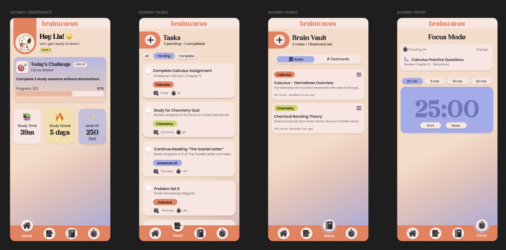

#Brainwaves Productivity Application

This project was developed collaboratively as part of coursework at The University of Texas at San Antonio. It was designed to help students organize tasks, track coursework, capture notes, and maintain focus in a gamified environment.

## ✨ Features
- Task management dashboard
- Pomodoro timer
- Note-taking functionality
- MVC architecture

## 💻 Technologies Used
- Java
- JavaFX
- CSS
- GitHub

## 🛠️ My Contributions
- Developed application functionality using Java and JavaFX.
- Implemented components following the MVC architectural pattern.
- Collaborated with team members through GitHub throughout development.
- Designed the application's UI prototype and contributed to translating the design into the final JavaFX interface.
- Contributed to UI styling and visual design using JavaFX and CSS.
- Participated in debugging, feature development, and integration.

## 🎨 User Interface & Figma Prototypes

Designed end-to-end Figma prototypes translating functional productivity requirements into modern, intuitive mobile/desktop views before translating them into JavaFX and CSS styling.

### Key UI Features
* **Dashboard:** Gamified learning progress with streak tracking, XP milestones, and daily challenges[cite: 1].
* **Task Manager:** Categorized, priority-filtered task tracking sorted by subject tags (Calculus, Chemistry, etc.)[cite: 1].
* **Brain Vault:** Integrated note-taking and flashcard system organized by academic disciplines[cite: 1].
* **Focus Mode:** Dedicated Pomodoro-style timer tied directly to active study tasks[cite: 1].

